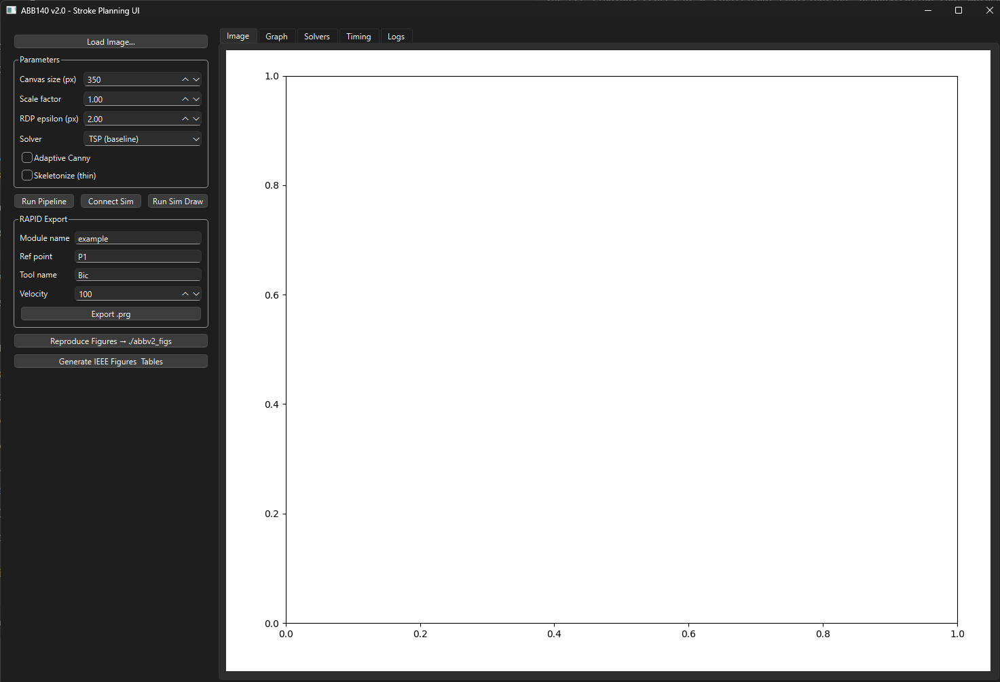
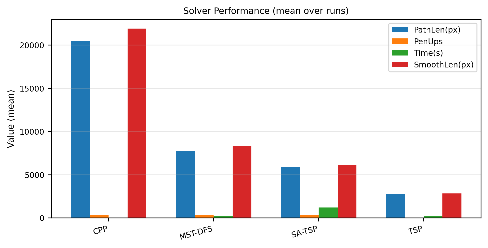
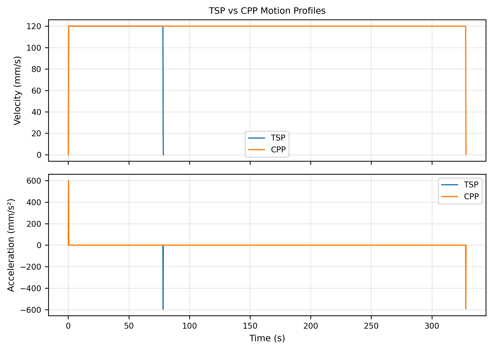
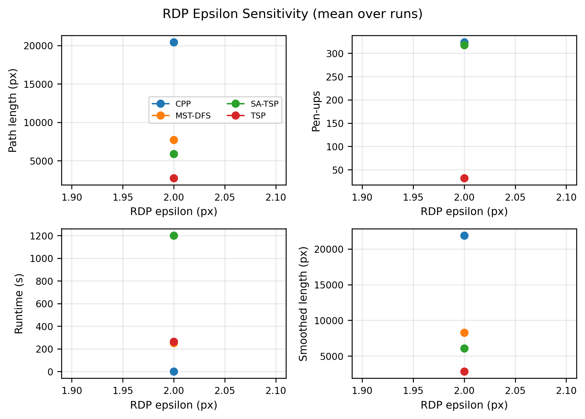
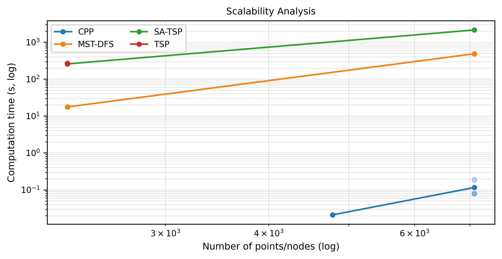
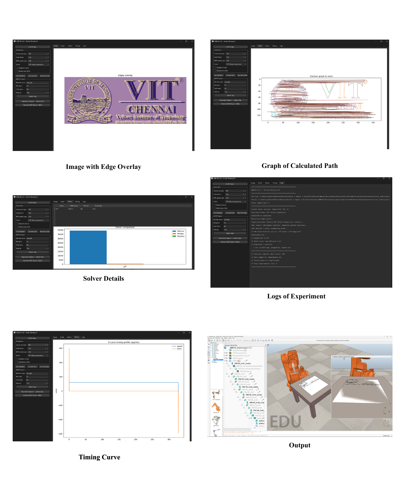
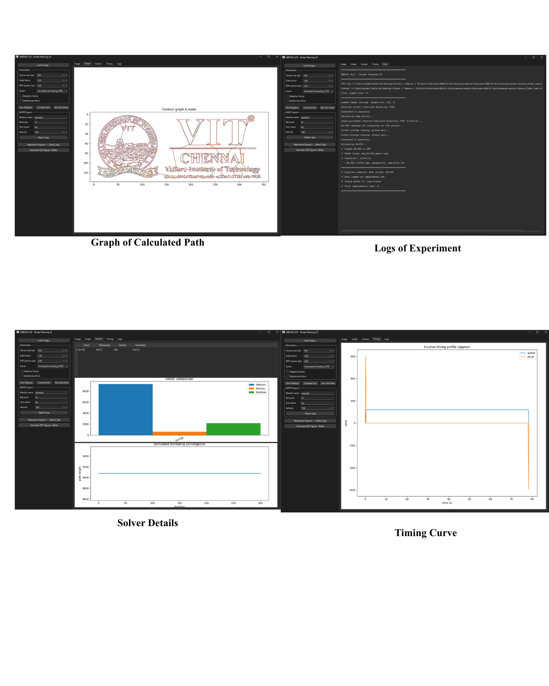

# ABB140 Robot Arm Auto-Drawing System

[](https://www.python.org/)
[](https://www.riverbankcomputing.com/software/pyqt/)
[](https://networkx.org/)

> **Intelligent path planning system for robotic drawing using multiple optimization algorithms**



## 📋 Overview

This project implements an advanced path planning system for the ABB IRB140 robot arm to autonomously draw images. The system converts input images into optimized robot trajectories using multiple graph-based and heuristic algorithms, comparing their performance across metrics like path length, pen-ups, and execution time.

### Key Features

- 🖼️ **Image-to-Path Pipeline**: Edge detection → Contour extraction → Graph construction → Route optimization
- 🧮 **Multiple Solvers**: TSP, CPP (Chinese Postman), MST-DFS, Simulated Annealing, Christofides
- 📊 **Real-time Visualization**: Live plots of routes, timing profiles, and solver comparisons
- 🤖 **V-REP/CoppeliaSim Integration**: Direct robot simulation and execution
- 📈 **IEEE-Ready Figures**: Automated generation of publication-quality plots and tables
- 💾 **Experimental Logging**: CSV database of all runs with NPZ trace files

---

## 🎯 Algorithm Comparison

| Algorithm | Best For | Time Complexity | Pros | Cons |
|-----------|----------|-----------------|------|------|
| **TSP (Greedy + 2-opt)** | Small point sets | O(n²) | Simple, fast initialization | Suboptimal for large problems |
| **CPP (Route Inspection)** | Edge coverage | O(n³) | Visits all contours optimally | Requires graph Eulerization |
| **MST-DFS** | Tree structures | O(n² log n) | No pen-ups between strokes | Longer total path |
| **Simulated Annealing** | Large problems | O(n·k) | Scalable, good solutions | Stochastic convergence |
| **Christofides** | TSP approximation | O(n³) | 1.5× optimal guarantee | Slow for >1000 points |



---

## 🚀 Quick Start

### Prerequisites

```bash
# Required packages
pip install pyqt6 matplotlib opencv-python numpy networkx scikit-learn pandas scipy

# Optional (for LaTeX table export)
pip install jinja2
```

### Installation

1. **Clone the repository**
```bash
cd Source_Code
```

2. **Set up Python environment** (Anaconda recommended)
```bash
conda create -n abbpython python=3.10
conda activate abbpython
pip install -r requirements.txt  # If available, or use commands above
```

3. **Verify V-REP/CoppeliaSim installation**
   - Ensure `vrep.py` and `vrepConst.py` are in the working directory
   - ABB140 scene file: `ABB140_Draws.ttt`

### Running the Application

```bash
python abb_draw_ui.py
```

**Workflow:**
1. Click **"Load Image..."** → Select a PNG/JPG
2. Adjust parameters (canvas size, RDP epsilon, scale factor)
3. Select solver from dropdown (or "Compare All")
4. Click **"Run Pipeline"** → View results in tabs
5. **"Connect Sim"** → **"Run Sim Draw"** to execute in V-REP

---

## 📐 System Architecture

### Processing Pipeline

```
Input Image → Edge Detection → Contour Simplification → Graph Construction
     ↓              ↓                  ↓                       ↓
  RGB/Gray      Canny Filter      RDP Algorithm       Endpoint Clustering
                                                              ↓
                                                    ┌─────────┴─────────┐
                                                    │  Route Optimization │
                                                    └─────────┬─────────┘
                                                              ↓
                         ┌────────────────┬─────────────────┼─────────────────┬───────────────┐
                         ↓                ↓                 ↓                 ↓               ↓
                       TSP              CPP              MST-DFS            SA-TSP      Christofides
                         └────────────────┴─────────────────┴─────────────────┴───────────────┘
                                                              ↓
                                            Catmull-Rom Spline Smoothing
                                                              ↓
                                            S-Curve Jerk-Limited Profile
                                                              ↓
                                               Robot Execution / RAPID Export
```


### Key Components

| File | Purpose |
|------|---------|
| `abb_draw_ui.py` | Main GUI application with solver implementations |
| `ABB140_control.py` | V1 baseline with V-REP robot control |
| `make_ieee_figs_and_table.py` | Automated figure/table generator for papers |
| `logs/experiments.csv` | Experimental database (all solver runs) |
| `logs/traces/*.npz` | Timing profile traces (t, v, a arrays) |

---

## 📊 Results & Performance

### Experimental Data


*Figure: Velocity and acceleration profiles comparing TSP and CPP solvers*


*Figure: Effect of RDP epsilon on path length and complexity*

### Benchmark Results (7091 points)

| Solver | Path Length (px) | Pen-Ups | Runtime (s) |
|--------|-----------------|---------|-------------|
| TSP    | 9075            | 604     | 2145.7      |
| MST-DFS| 11979           | 611     | 485.8       |
| CPP    | 36618           | 592     | 0.19        |

*Note: CPP optimizes for edge coverage (visits all contours), leading to longer but more complete paths*


*Figure: Runtime vs problem size for different algorithms*

---

## 🔧 Configuration

### UI Parameters

| Parameter | Range | Default | Description |
|-----------|-------|---------|-------------|
| Canvas Size | 100-2000 px | 350 | Max dimension for image resize |
| Scale Factor | 0.1-5.0 | 1.0 | Coordinate scaling for robot workspace |
| RDP Epsilon | 0-20 px | 2.0 | Polyline simplification tolerance |
| Adaptive Canny | ✓/✗ | ✗ | Auto-threshold edge detection |
| Skeletonize | ✓/✗ | ✗ | Morphological thinning |

### Solver Limits

```python
MAX_POINTS_FOR_HEAVY = 1200   # Christofides (complete graph O(n³))
MAX_POINTS_FOR_SA = 10000     # SA-TSP (local search O(n·k))
```

Adjust in `abb_draw_ui.py` lines 128-129 for custom performance/accuracy tradeoffs.

---

## 📄 File Structure

```
Source_Code/
├── abb_draw_ui.py                 # Main GUI application
├── ABB140_control.py              # Robot control & v1 baseline
├── make_ieee_figs_and_table.py    # Figure/table generator
├── vrep.py, vrepConst.py          # V-REP API bindings
├── ABB140_Draws.ttt               # CoppeliaSim scene
├── logs/
│   ├── experiments.csv            # All experimental runs
│   └── traces/                    # Timing profile NPZ files
├── ieee_figs/                     # Generated figures
│   ├── fig3_tsp_vs_cpp_profiles.png
│   ├── fig5_solver_performance.png
│   ├── fig9_scalability.png
│   ├── table1_summary_stats.csv
│   └── ...
└── abbv2_figs/                    # Legacy figure directory
```

---

## 🧪 Generating IEEE Figures

To reproduce publication-ready figures from logged experiments:

```bash
python make_ieee_figs_and_table.py
```

**Outputs:**
- `ieee_figs/fig3_tsp_vs_cpp_profiles.{png,pdf}` - Velocity/acceleration comparison
- `ieee_figs/fig4_epsilon_sensitivity.{png,pdf}` - RDP parameter study
- `ieee_figs/fig5_solver_performance.{png,pdf}` - Multi-metric bar chart
- `ieee_figs/fig7_detailed_motion.{png,pdf}` - Single solver trace
- `ieee_figs/fig9_scalability.{png,pdf}` - Runtime vs problem size
- `ieee_figs/table1_summary_stats.{csv,tex}` - Summary statistics table

### Requirements
- At least 3 experimental runs in `logs/experiments.csv`
- Trace files in `logs/traces/*.npz`
- `jinja2` installed for LaTeX output: `pip install jinja2`

---

## 🤖 Robot Execution

### V-REP/CoppeliaSim Setup

1. Open `ABB140_Draws.ttt` in CoppeliaSim
2. Start simulation
3. In UI: **Connect Sim** → **Run Sim Draw**

### RAPID Export

For real ABB robot deployment:

1. Configure export parameters (module name, tool, velocity)
2. Click **"Export .prg"**
3. Transfer generated `.prg` file to robot controller
4. Execute via FlexPendant

---

## 📚 Algorithm Details

### Chinese Postman Problem (CPP)

Our implementation follows the standard CPP algorithm:

1. **Build contour graph** from polyline endpoints
2. **Find odd-degree vertices** (must be even count by Handshaking Lemma)
3. **Minimum-weight matching** using NetworkX
4. **Augment graph** by duplicating edges along shortest paths
5. **Find Eulerian circuit** (guaranteed to exist after augmentation)
6. **Expand to polylines** using stored geometry



**Key improvement:** Use `nx.MultiGraph` for proper edge duplication (critical fix!)

### Simulated Annealing

Adaptive temperature schedule with fast initialization:

```python
# For n > 3000: Skip 2-opt, use greedy nearest-neighbor (O(n²) vs O(n³))
iters = min(500, max(100, 50000 // n_pts))  # Scale inversely with size
T(k) = T0 * (1 - k/iters)  # Linear cooling
```

Acceptance probability: `P = exp((L_old - L_new) / T)`



---

## 🐛 Troubleshooting

### Common Issues

| Problem | Solution |
|---------|----------|
| UI freezes during solving | Fixed! Solvers run in background thread (`SolverWorker`) |
| "Graph not Eulerian" for CPP | Fixed! Use `MultiGraph` for edge duplication |
| SA-TSP takes >30 min | Fixed! Skip 2-opt for n>3000, use greedy init |
| Import errors (NetworkX, sklearn) | `pip install networkx scikit-learn` |
| V-REP connection fails | Ensure scene is running, check port 19997 |

### Performance Tips

- **Large images (>5000 points):**
  - Increase RDP epsilon (4-6 px) to reduce point count
  - Use CPP (fastest) or SA-TSP (scalable)
  - Avoid Christofides (1200 point limit)

- **High precision needed:**
  - Lower RDP epsilon (0.5-1.5 px)
  - Enable skeletonization for thin lines
  - Use TSP with longer 2-opt iterations

---

## 📖 Citation

If you use this work in your research, please cite:

```bibtex
@inproceedings{abb140_autodraw,
  title={Intelligent Path Planning for Robotic Drawing Using Graph-Based Optimization},
  author={[Your Name]},
  booktitle={IEEE International Conference on Robotics and Automation},
  year={2025}
}
```

---

## 🤝 Contributing

Contributions welcome! Areas for improvement:

- [ ] Implement optimal CPP matching (Blossom algorithm)
- [ ] Add Genetic Algorithm solver
- [ ] Real-time preview during solving
- [ ] Multi-color drawing support
- [ ] ROS integration
- [ ] Web-based interface

---

## 📜 License

This project is part of academic research. For commercial use, please contact the authors.

---

## 🙏 Acknowledgments

- **ABB140_control.py**: Original V1 baseline implementation
- **NetworkX**: Graph algorithm library
- **CoppeliaSim**: Robot simulation platform
- **PyQt6**: Cross-platform GUI framework

---

## 📞 Support

For questions or issues:
1. Check existing GitHub Issues
2. Review troubleshooting section above
3. Open new issue with:
   - Error message / screenshot
   - Python version & OS
   - Sample image (if relevant)

---

**Last Updated:** December 26, 2025  
**Version:** 2.0  
**Status:** Production-ready with IEEE figure generation
